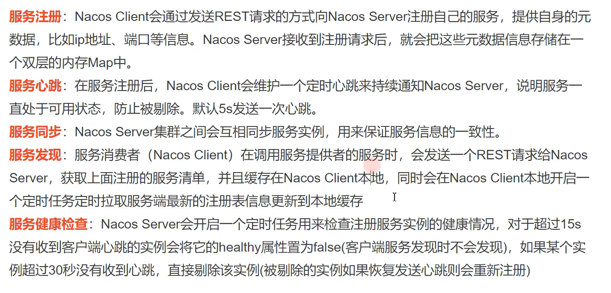

---
1.nacos作用：注册中心，解决服务的注册与发现

2.Sentinel作用：随着微服务的流行，服务和服务之间的稳定性变得越来越重要。Sentinel 以流量为切入点，从流量控制、熔断降级、系统负载保护等多个维度保护服务的稳定性。

3.Sleuth：链路追踪

4.gateway：微服务网关，服务集群的入口，路由转发以及负载均衡（全局认证、流控）

5.Ribbon：客户端负载均衡器，解决微服务集群负载均衡的问题

6.OpenFegin：

---

1.首先在nacos中进行服务的一个注册

2.通过Gateway网关进行服务的一个路由和全局认证。

3.通过OpenFegin进行一个服务发现和调用

4.如果出现流量问题，则选择Sentinel进行流量控制和熔断降级。

5.使用Sleuth进行一个服务的链路追踪，快速准确地定义到问题的所在。

---

一、nacos：
1.解压安装（推荐）

第一步：解压

第二步：配置（conf>application.properties)

第三步：在mysql中创建nacos数据库

nacos-mysql.sql

第四步：在nacos中建表（建表语句在conf>nacos-mysql.sql）

第五步：修改bin>startup.cmd

nacos-1.3.2之后默认使用的【集群方式】启动,需要手动改为standalone单机模式(编辑startup.cm文件)

双击bin>startup.cmd,启动成功

---
2.nacos工作流程（nacos的作用）



3.创建父工程：
```xml

<parent>
    <groupId>org.springframework.boot</groupId>
    <artifactId>spring-boot-starter-parent</artifactId>
    <version>2.3.2.RELEASE</version>
    <relativePath/> <!-- lookup parent from repository -->
</parent>

<properties>
    <project.build.sourceEncoding>UTF-8</project.build.sourceEncoding>
    <project.reporting.outputEncoding>UTF-8</project.reporting.outputEncoding>
    <java.version>1.8</java.version>
</properties>

<dependencyManagement>
    <dependencies>
        <dependency>
            <groupId>com.alibaba.cloud</groupId>
            <artifactId>spring-cloud-alibaba-dependencies</artifactId>
            <version>2.2.5.RELEASE</version>
            <type>pom</type>
            <scope>import</scope>
        </dependency>
        <dependency>
            <groupId>org.springframework.cloud</groupId>
            <artifactId>spring-cloud-dependencies</artifactId>
            <version>Hoxton.SR8</version>
            <type>pom</type>
            <scope>import</scope>
        </dependency>

    </dependencies>
</dependencyManagement>
```

4.pom.xml
```xml


    <dependencies>
        <!--    所有的微服务都是springboot web工程    -->
        <dependency>
            <groupId>org.springframework.boot</groupId>
            <artifactId>spring-boot-starter-web</artifactId>
        </dependency>

        <!--端点监控，暴露一些健康检查的接口，nacos-server调用来获取微服务的健康状态-->
        <dependency>
            <groupId>org.springframework.boot</groupId>
            <artifactId>spring-boot-starter-actuator</artifactId>
        </dependency>

        <!--进行微服务的注册与发现-->
        <dependency>
            <groupId>com.alibaba.cloud</groupId>
            <artifactId>spring-cloud-starter-alibaba-nacos-discovery</artifactId>
        </dependency>
    </dependencies>

<build>
    <plugins>
        <plugin>
            <groupId>org.springframework.boot</groupId>
            <artifactId>spring-boot-maven-plugin</artifactId>
        </plugin>
    </plugins>
</build>
```

5.application.properties:
```properties
#service name，每个微服务都要配置应用的名称，保证唯一
spring:
  application:
    name: wfx-goods
  cloud:
    nacos:
      discovery:
        server-addr: 127.0.0.1:8848 #配置注册中心的地址
server:
  port: 8001


#
management.endpoints.web.exposure.include=*
```
6.启动类加注解：
```java
package com.wfx;


import org.springframework.boot.SpringApplication;
import org.springframework.boot.autoconfigure.SpringBootApplication;
import org.springframework.cloud.client.discovery.EnableDiscoveryClient;

@SpringBootApplication
@EnableDiscoveryClient//开启服务注册与发现
public class GoodsApplication {

    public static void main(String[] args) {
        SpringApplication.run(GoodsApplication.class,args);
    }

}
```
二、OpenFgien:

1.作为Spring Cloud的子项目之一，Spring Cloud OpenFeign 是一种声明式、模板化的 HTTP 客户端，在 Spring Cloud 中使用 OpenFeign，可以做到使用 HTTP请求远程服务时能与调用本地方法一样的编码体验，开发者完全感知不到这是远程方法，更感知不到这是个 HTTP 请求。同时OpenFeign通过集成Ribbon实现客户端的负载均衡

---
2.依赖：
```xml
 <dependencies>
        <dependency>
            <groupId>org.springframework.boot</groupId>
            <artifactId>spring-boot-starter-web</artifactId>
        </dependency>

        <dependency>
            <groupId>org.springframework.boot</groupId>
            <artifactId>spring-boot-starter-actuator</artifactId>
        </dependency>

        <dependency>
            <groupId>com.alibaba.cloud</groupId>
            <artifactId>spring-cloud-starter-alibaba-nacos-discovery</artifactId>
        </dependency>
    </dependencies>

    <build>
        <plugins>
            <plugin>
                <groupId>org.springframework.boot</groupId>
                <artifactId>spring-boot-maven-plugin</artifactId>
            </plugin>
        </plugins>
    </build>
```
3.application.properties
```properties
server.port=8003
spring.application.name=wfx-jifen
spring.cloud.nacos.discovery.server-addr=127.0.0.1:8848
management.endpoints.web.exposure.include=*
```
4.启动类：
```java
@SpringBootApplication
@EnableDiscoveryClient
public class JifenApplication {
    public static void main(String[] args) {
        SpringApplication.run(JifenApplication.class,args);
    }
}
```

三、小结：

nacos 【name server】：注册中心，解决服务的注册与发现
  
  Ribbon：客户端负载均衡器，解决微服务集群负载均衡的问题
  
  Openfeign：声明式HTTP客户端，解决微服务之间远程调用问题
  
  Sentinel：微服务流量防卫兵,以流量为入口，保护微服务，防止服务雪崩
  
  gateway：微服务网关，服务集群的入口，路由转发以及负载均衡（全局认证、流控）

